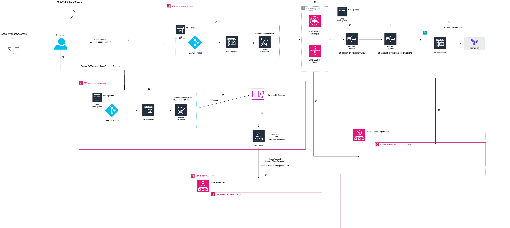

## Govern Multi Account Account Closure and Suspension using custom solutions for Account Factory for Terraform (AFT)

The primary goal of this APG is to introduce a solution that leverages AWS Control Tower Account Factory Terraform (AFT) to streamline the account closure and suspension process. The solution aims to provide a reliable, efficient, and fast way to manage the decommissioning of AWS accounts from organizations.

The APG will highlight the integration of account closure and suspension custom solution with AFT to automate the account decommissioning process, eliminating the need for manual interventions. This approach will enhance the overall operational efficiency and ensure a standardized, secure, and consistent decommissioning process for AWS Control Tower.

By automating the account decommissioning using AWS Lambda function, the solution addresses the crucial need for rapid and secure decommissioning of AWS accounts at scale, without compromising on security standards.

## AFT (Account Factory for Terraform)  Overview

As per documentation here, AFT sets up a Terraform pipeline that helps you provision and customize your accounts in AWS Control Tower. AFT follows a GitOps model to automate the processes of account provisioning in AWS Control Tower. You'll create an account request Terraform file, commit to repository, which provides the necessary input that triggers the AFT workflow for account provisioning. After account provisioning is complete, AFT can run additional customization steps, automatically.

## Solution Architecture



The above architecture workflow digram illustrates both AWS Account creation as well as account closure workflow. This custom solution discussed here is for the account closure or suspension workflow because account closure and/or suspension is not part of standard AFT product. This custom solution enables that facility by creating an `AWS Lambda Function  which gets triggered by Amazon DynamoDB Streams` to close an existing AWS account created/imported by AFT (Account Factory for Terraform) and then finally moves the closed account to a designated  `Suspended OU` . Step by step solution workflow is as below -

The initial request to close an AWS Account can be initiated as soon as an account is fully created by AFT or imported by AFT.

The Operator initiates account closure request using AFT repository `aft-account-request`. This is the repository informs AFT about all the metadata Operator has provided for account creation and/or closure. The Account metadata in `aft-request-metadata` DynamoDB table. This table contains all the metadata operator has provided in the account-requests.tf  table.

User pushes Terraform Code `(Operator removes specific account module (module "account_request" {} from account-requests.tf)` which then informs AFT to remove an AWS account from AFT management control and finally close and move the account to an designated Suspended OU  to Git repository (for example GitHub, Amazon CodeCommit etc).

The above operation triggers AFT to record account removal request in the `aft-request-audit` DynamoDB table. This table has a DynamoDB stream (All AFT DynamoDB tables have streams enabled) already enabled which thereby triggers an AWS Lambda Function `aft_suspend_account_ou`.

This Lambda function aft_suspend_account_ou ( which resides in the AFT Management Account ) now fetches below account metadata from aft-request-audit  using new images of DDB streams -

```bash
	     AccName = newImage['control_tower_parameters']['M']['AccountName']['S']    # Account Name (required)
		AccEmail = newImage['control_tower_parameters']['M']['AccountEmail']['S']  # Account Email (required)
		SSOEmail = newImage['control_tower_parameters']['M']['SSOUserEmail']['S']  # SSO registration Email (optional)
		SSOFirstName = newImage['control_tower_parameters']['M']['SSOUserFirstName']['S'] # SSO registration First Name (optional)
		SSOLastName = newImage['control_tower_parameters']['M']['SSOUserLastName']['S']  # SSO registration Last Name (optional)
		DDEvent = newImage['ddb_event_name']['S'] # DDB Event Name (required)
		SourceOU = newImage['control_tower_parameters']['M']['ManagedOrganizationalUnit']['S']	# Parent OU information (required)
```

If Lambda function finds the value as  `REMOVE` for the `DDEvent` parameter value, it fetches the relevant `Account ID` by using the `email` value from the `aft-request-metadata` DynamoDB table and matching with `AccEmail` parameter fetched from the `aft-account-request`  to confirm the `Account`  to be closed/suspended.

At this stage Lambda Function knows the right combination of `Account ID` and the `ParentOU` under which the Account is placed. 

The Lambda Function now performs cross-account jump from AFT Management Account to the AWS Control Tower Account to perform AWS Organisation BOTO3 Calls to close the Account first and then finally move the account to a designation Suspended OU.


### Requirements

| Name | Version |
|------|---------|
| <a name="requirement_terraform"></a> [terraform](#requirement\_terraform) | >= 0.15.0 |
| <a name="requirement_aws"></a> [aws](#requirement\_aws) | >= 3.15 |

### Providers

| Name | Version |
|------|---------|
| <a name="provider_archive"></a> [archive](#provider\_archive) | n/a |
| <a name="provider_aws"></a> [aws](#provider\_aws) | >= 3.15 |

### Modules

No modules.

### Resources

| Name | Type |
|------|------|
| [aws_cloudwatch_log_group.aft_suspend_account_ou_lambda_log](https://registry.terraform.io/providers/hashicorp/aws/latest/docs/resources/cloudwatch_log_group) | resource |
| [aws_iam_policy.lambda_assume_acc_close_policy](https://registry.terraform.io/providers/hashicorp/aws/latest/docs/resources/iam_policy) | resource |
| [aws_iam_role.iam_for_account_suspend_lambda](https://registry.terraform.io/providers/hashicorp/aws/latest/docs/resources/iam_role) | resource |
| [aws_iam_role_policy.dynamodb_lambda_policy](https://registry.terraform.io/providers/hashicorp/aws/latest/docs/resources/iam_role_policy) | resource |
| [aws_iam_role_policy_attachment.assume_policy_attach_acc_close](https://registry.terraform.io/providers/hashicorp/aws/latest/docs/resources/iam_role_policy_attachment) | resource |
| [aws_kms_alias.aft_kms_alias](https://registry.terraform.io/providers/hashicorp/aws/latest/docs/resources/kms_alias) | resource |
| [aws_kms_key.aft_kms_key](https://registry.terraform.io/providers/hashicorp/aws/latest/docs/resources/kms_key) | resource |
| [aws_lambda_code_signing_config.this](https://registry.terraform.io/providers/hashicorp/aws/latest/docs/resources/lambda_code_signing_config) | resource |
| [aws_lambda_event_source_mapping.lambda_dynamodb](https://registry.terraform.io/providers/hashicorp/aws/latest/docs/resources/lambda_event_source_mapping) | resource |
| [aws_lambda_function.aft_suspend_account_ou_lambda](https://registry.terraform.io/providers/hashicorp/aws/latest/docs/resources/lambda_function) | resource |
| [aws_signer_signing_profile.this](https://registry.terraform.io/providers/hashicorp/aws/latest/docs/resources/signer_signing_profile) | resource |
| [aws_sqs_queue.aftlambdadlq](https://registry.terraform.io/providers/hashicorp/aws/latest/docs/resources/sqs_queue) | resource |
| [archive_file.aft_suspend_account](https://registry.terraform.io/providers/hashicorp/archive/latest/docs/data-sources/file) | data source |
| [aws_arn.aft_to_ct_cross_account_role_arn](https://registry.terraform.io/providers/hashicorp/aws/latest/docs/data-sources/arn) | data source |
| [aws_caller_identity.aft_management_id](https://registry.terraform.io/providers/hashicorp/aws/latest/docs/data-sources/caller_identity) | data source |
| [aws_iam_policy.AmazonSQSFullAccess](https://registry.terraform.io/providers/hashicorp/aws/latest/docs/data-sources/iam_policy) | data source |
| [aws_iam_policy.CloudWatchFullAccess](https://registry.terraform.io/providers/hashicorp/aws/latest/docs/data-sources/iam_policy) | data source |
| [aws_iam_policy_document.assume_role_policy](https://registry.terraform.io/providers/hashicorp/aws/latest/docs/data-sources/iam_policy_document) | data source |
| [aws_iam_policy_document.dynamodb_lambda_policy](https://registry.terraform.io/providers/hashicorp/aws/latest/docs/data-sources/iam_policy_document) | data source |
| [aws_iam_policy_document.key_initial](https://registry.terraform.io/providers/hashicorp/aws/latest/docs/data-sources/iam_policy_document) | data source |
| [aws_iam_policy_document.lambda_assume_acc_close_policy](https://registry.terraform.io/providers/hashicorp/aws/latest/docs/data-sources/iam_policy_document) | data source |
| [aws_region.aft_management_region](https://registry.terraform.io/providers/hashicorp/aws/latest/docs/data-sources/region) | data source |

### Inputs

| Name | Description | Type | Default | Required |
|------|-------------|------|---------|:--------:|
| <a name="input_aft-request-audit-table-encrption-key-id"></a> [aft-request-audit-table-encrption-key-id](#input\_aft-request-audit-table-encrption-key-id) | DynamoDB table aft-request-audit table stream ARN | `string` | `""` | no |
| <a name="input_aft-request-audit-table-stream-arn"></a> [aft-request-audit-table-stream-arn](#input\_aft-request-audit-table-stream-arn) | DynamoDB table aft-request-audit table stream ARN | `string` | `""` | no |
| <a name="input_aft_to_ct_cross_account_role_name"></a> [aft\_to\_ct\_cross\_account\_role\_name](#input\_aft\_to\_ct\_cross\_account\_role\_name) | AFT Cross Account Role | `string` | `"AFTCrossAccountRole"` | no |
| <a name="input_cloudwatch_log_group_retention"></a> [cloudwatch\_log\_group\_retention](#input\_cloudwatch\_log\_group\_retention) | Lambda CloudWatch log group retention period | `string` | `"0"` | no |
| <a name="input_ct_account_id"></a> [ct\_account\_id](#input\_ct\_account\_id) | AFT Account ID | `string` | `""` | no |
| <a name="input_ct_destination_ou"></a> [ct\_destination\_ou](#input\_ct\_destination\_ou) | Destination OU into which Account will be moved | `string` | `""` | no |
| <a name="input_ct_root_ou_id"></a> [ct\_root\_ou\_id](#input\_ct\_root\_ou\_id) | CT Account Root OU ID | `string` | `""` | no |
| <a name="input_default_tags"></a> [default\_tags](#input\_default\_tags) | Default tags for the module | `map(string)` | <pre>{<br>  "CostCenter": "ACME",<br>  "Environment": "AFT",<br>  "Owner": "ACME Corp",<br>  "Project": "ACME Project"<br>}</pre> | no |
| <a name="input_private1_subnet_id"></a> [private1\_subnet\_id](#input\_private1\_subnet\_id) | Private Subnet 1 | `string` | `""` | no |
| <a name="input_private2_subnet_id"></a> [private2\_subnet\_id](#input\_private2\_subnet\_id) | Private Subnet 2 | `string` | `""` | no |
| <a name="input_private_sg_id"></a> [private\_sg\_id](#input\_private\_sg\_id) | Private Subnet Security Group | `string` | `""` | no |
| <a name="input_region"></a> [region](#input\_region) | Default Region | `string` | `"us-west-2"` | no |

### Outputs

| Name | Description |
|------|-------------|
| <a name="output_aft_alternate_sso_extract_lambda_arn"></a> [aft\_alternate\_sso\_extract\_lambda\_arn](#output\_aft\_alternate\_sso\_extract\_lambda\_arn) | aft-alternate-sso-extract Lambda ARN |
<!-- END_TF_DOCS -->